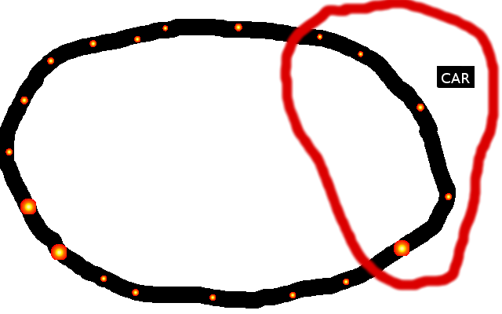
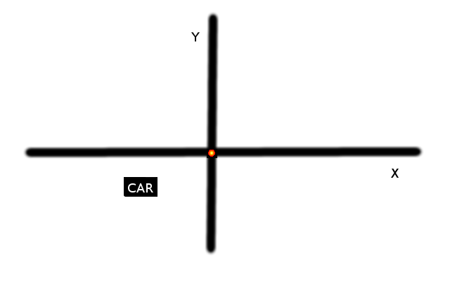
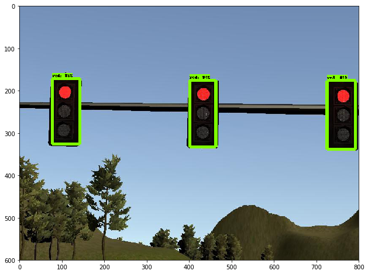

# S-team

This is the 'S-team' repository for capston project of Udacity Self-Driving Car Nanodegree. 
Team members are:

* arjuna sky kok (sky.kok@speaklikeaking.com)
* William Du (dm1299onion@gmail.com)
* Abhinav Deep Singh(abhinav1010.ads@gmail.com)
* Woojin jung(xmprise@gmail.com)

Thank you all.

## System Architecture

### Waypoint Updater

We are given the all waypoints in the circuit. We must find the nearest waypoints ahead of the
car. All waypoints have x, y coordinates and yaw direction. The way we find whether this waypoint
is ahead of the car or not by doing two steps:
* Find the euclidian distance between the car and the waypoint and we throw out all waypoints
  that have distance bigger than 50.

  

* For every waypoint that has been filtered, we transform the world coordinates to local
  coordinates (from waypoint centric point of view), then we check whether the car coordinate
  has negative x value or not. If it is, then the waypoint is ahead of the car.

  

### DBW Node

After publishing the final waypoints (the nearest waypoints that are ahead of the car), the
system will generate the velocity recommendation that we can receive in dbw node part. We got
the current velocity as well. So we have speed difference or speed error. We can find throttle
value from pid controller that accept this speed error. The steering value (so we can follow
the curve of the road) can be taken from yaw controller. If the speed error is negative (meaning
we exceed our speed recommendation), we set throttle to be 0 and the brake to be negative of
speed error (which is negative) then multiplied by 1000.

### Traffic Lights Detection

There are two models for Traffic Lights Detection, one for Simulator, another for Udacity Test Site.  
If simulator used, please change GRAPH_FILE='models/frozen_inference_graph_simulator.pb' in tl_classifier.py  
If test site used, please change GRAPH_FILE='models/frozen_inference_graph_test_site.pb' in tl_classifier.py 

If there are mutiple traffic lights are detected, the class of bounding box with highest socres will return. A pre-trained MobileNet on coco dateset was used. We also collected and annotated simulator and test site data.

### Waypoint Updater Part 2

Once we got the red traffic light waypoint, we could calculate how many waypoints the traffic light
waypoint is ahead of our car. Then we can segment our speed recommendation based on how far
the red traffic light is.

If it is very near, we can set the speed recommendation to 0 (stop completely). If it is very far,
we can set it as 11 m / s. In between, we can take the value between 0 and 11.

| How far red light | Speed recommendation |
| ------------------|:--------------------:|
| 0 - 37            | 0                    |
| 37 - 45           | 1                    |
| 45 - 60           | 3                    |
| 60 - 70           | 5                    |
| 70 - 100          | 7                    |
| 100 - 120         | 9                    |
| 120 - 200         | 10                   |
| > 200             | 11.11                |
